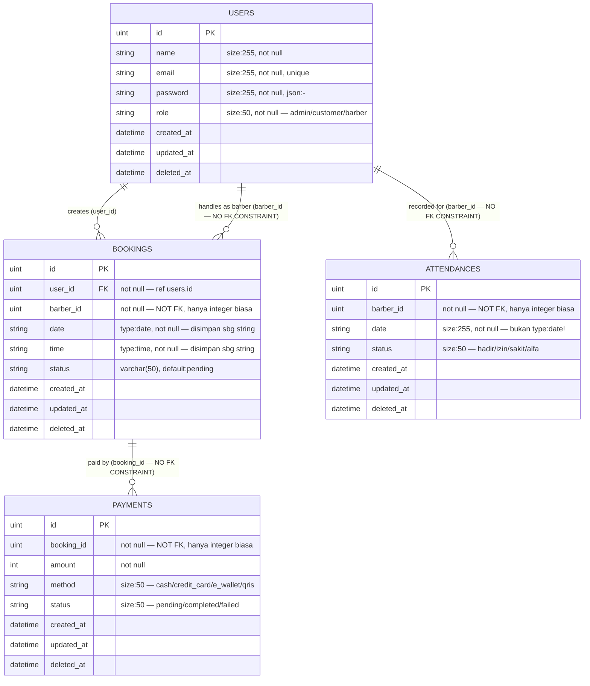
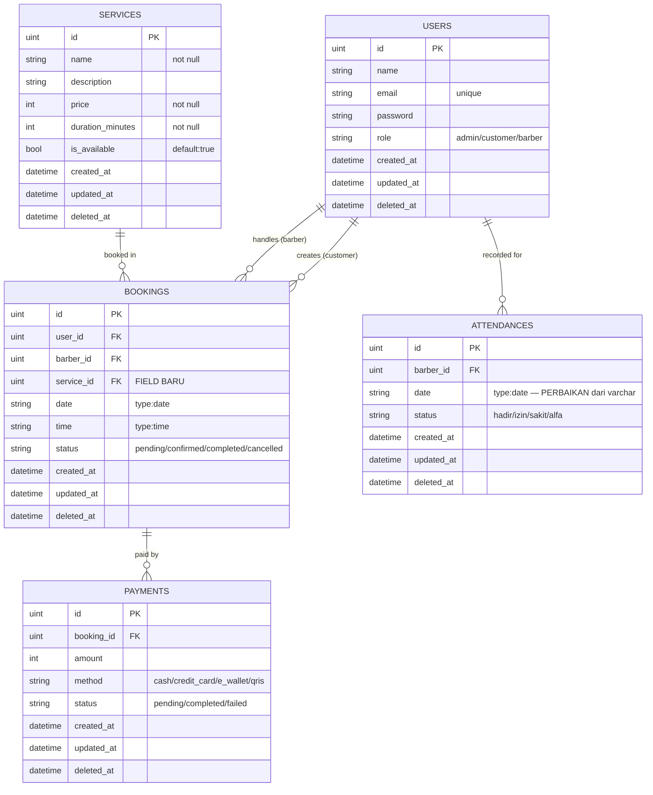

# ERD & Database Structure Analysis
# Zig-Zag Barbershop — Backend Audit

**Tanggal:** 3 Juni 2026  
**Source:** Analisis source code aktual — bukan asumsi  
**Scope:** `internal/`, `api/router.go`, `cmd/main.go`, `frontend/src/`

---

## 1. ERD Aktual (Berdasarkan GORM Model)

### ERD — State Saat Ini (As-Is)



### Legenda FK Constraint

| Relasi | Ada di DB? | Catatan |
|--------|-----------|---------|
| `bookings.user_id → users.id` | ❌ Tidak ada | Hanya ada di level aplikasi (GORM query) |
| `bookings.barber_id → users.id` | ❌ Tidak ada | Integer tanpa constraint apapun |
| `payments.booking_id → bookings.id` | ❌ Tidak ada | Integer tanpa constraint apapun |
| `attendances.barber_id → users.id` | ❌ Tidak ada | Integer tanpa constraint apapun |

> **Catatan Kritis:** GORM `AutoMigrate` secara default **tidak membuat Foreign Key constraint**. Semua relasi hanya bersifat logis di level aplikasi. Database tidak memiliki referential integrity sama sekali.

---

### ERD — State Target (To-Be, Setelah Penambahan Fitur)



---

## 2. Database Dictionary

### Tabel: `users`

| Property | Detail |
|----------|--------|
| **Tujuan** | Menyimpan semua jenis pengguna: admin, customer, dan barber. Role dibedakan via field `role` (string) |
| **Sumber Model** | `internal/user/model.go` |
| **AutoMigrate** | ✅ Ya — di `cmd/main.go` |
| **Status** | 🟢 **Active** |
| **Digunakan endpoint** | `POST /api/auth/register` (INSERT), `POST /api/auth/login` (SELECT) |
| **Digunakan handler** | `auth.Register()`, `auth.Login()` |
| **Masalah** | `role` adalah string bebas, tidak ada validasi di level DB. Bisa saja ada user dengan role = "superadmin" atau typo |

**Fields:**
| Field | Type DB | Constraint | Keterangan |
|-------|---------|-----------|------------|
| `id` | uint | PK, Auto-increment | GORM default |
| `name` | varchar(255) | NOT NULL | — |
| `email` | varchar(255) | NOT NULL, UNIQUE | — |
| `password` | varchar(255) | NOT NULL | Bcrypt hash, tidak pernah di-return ke JSON |
| `role` | varchar(50) | NOT NULL | "admin" / "customer" / "barber" |
| `created_at` | timestamp | — | GORM auto |
| `updated_at` | timestamp | — | GORM auto |
| `deleted_at` | timestamp | nullable | GORM soft delete |

---

### Tabel: `bookings`

| Property | Detail |
|----------|--------|
| **Tujuan** | Menyimpan data reservasi pelanggan ke barber |
| **Sumber Model** | `internal/booking/model.go` |
| **AutoMigrate** | ✅ Ya — di `cmd/main.go` |
| **Status** | 🟢 **Active** |
| **Digunakan endpoint** | `POST /api/booking`, `GET /api/booking`, `PUT /api/booking/:id/cancel`, `PUT /api/booking/:id/status` |
| **Digunakan handler** | `booking.CreateBookingHandler`, `booking.GetBookingHistoryHandler`, `booking.CancelBookingHandler`, `booking.UpdateBookingStatusHandler` |
| **Masalah kritis** | `barber_id` tidak divalidasi apakah ada di tabel `users`. Booking bisa dibuat dengan `barber_id = 999` yang tidak ada. Tidak ada `service_id` — booking tidak tahu layanan apa yang dipesan |

**Fields:**
| Field | Type DB | Constraint | Keterangan |
|-------|---------|-----------|------------|
| `id` | uint | PK | — |
| `user_id` | uint | NOT NULL | Customer. Tidak ada FK constraint |
| `barber_id` | uint | NOT NULL | Barber. Tidak ada FK constraint, tidak divalidasi |
| `date` | date | NOT NULL | Disimpan sebagai string di Go, tapi GORM tag `type:date` |
| `time` | time | NOT NULL | Disimpan sebagai string di Go, tapi GORM tag `type:time` |
| `status` | varchar(50) | NOT NULL, default:'pending' | pending/confirmed/completed/cancelled |
| `created_at` | timestamp | — | — |
| `updated_at` | timestamp | — | — |
| `deleted_at` | timestamp | nullable | Soft delete |

---

### Tabel: `payments`

| Property | Detail |
|----------|--------|
| **Tujuan** | Menyimpan data pembayaran per booking |
| **Sumber Model** | `internal/payment/model.go` |
| **AutoMigrate** | ✅ Ya — di `cmd/main.go` |
| **Status** | 🟡 **Partial** — tabel ada di DB, tapi tidak ada data yang masuk |
| **Digunakan endpoint** | `POST /api/payment` — **handler kosong `{}`** |
| **Digunakan handler** | Tidak ada handler yang diimplementasikan |
| **Masalah** | Endpoint terdaftar di router tapi handler adalah anonymous function kosong yang tidak return apapun ke client |

**Fields:**
| Field | Type DB | Constraint | Keterangan |
|-------|---------|-----------|------------|
| `id` | uint | PK | — |
| `booking_id` | uint | NOT NULL | Tidak ada FK constraint |
| `amount` | int | NOT NULL | Tidak ada validasi positif |
| `method` | varchar(50) | NOT NULL | cash/credit_card/e_wallet/qris |
| `status` | varchar(50) | NOT NULL | pending/completed/failed |
| `created_at` | timestamp | — | — |
| `updated_at` | timestamp | — | — |
| `deleted_at` | timestamp | nullable | — |

---

### Tabel: `attendances`

| Property | Detail |
|----------|--------|
| **Tujuan** | Mencatat kehadiran barber per hari |
| **Sumber Model** | `internal/attendance/model.go` |
| **AutoMigrate** | ✅ Ya — di `cmd/main.go` |
| **Status** | 🟡 **Partial** — tabel ada, tapi tidak ada data yang masuk |
| **Digunakan endpoint** | `POST /api/attendance` — **handler kosong `{}`** |
| **Digunakan handler** | Tidak ada handler yang diimplementasikan |
| **Masalah kritis** | `date` disimpan sebagai `varchar(255)` bukan `date`. Ini menyebabkan query sorting dan filtering berdasarkan tanggal tidak bekerja dengan benar |

**Fields:**
| Field | Type DB | Constraint | Keterangan |
|-------|---------|-----------|------------|
| `id` | uint | PK | — |
| `barber_id` | uint | NOT NULL | Tidak ada FK constraint |
| `date` | varchar(255) | NOT NULL | **Bug:** seharusnya `type:date` |
| `status` | varchar(50) | NOT NULL | hadir/izin/sakit/alfa |
| `created_at` | timestamp | — | — |
| `updated_at` | timestamp | — | — |
| `deleted_at` | timestamp | nullable | — |

---

## 3. Endpoint Dependency Map

### `POST /api/auth/register`

```
POST /api/auth/register
    │
    ├── Middleware: (none — public route)
    │
    └── Handler: auth.RegisterHandler()
        │   File: internal/auth/handler.go
        │   Validasi: binding:"required", email, min=6, oneof=admin customer barber
        │
        └── Service: auth.Register(name, email, password, role)
            │   File: internal/auth/service.go
            │   Logic: bcrypt.GenerateFromPassword (cost=14)
            │
            └── Model: user.User{}
                │   File: internal/user/model.go
                │
                └── DB Table: users
                    Query: INSERT INTO users (name, email, password, role) VALUES (...)
```

---

### `POST /api/auth/login`

```
POST /api/auth/login
    │
    ├── Middleware: (none — public route)
    │
    └── Handler: auth.LoginHandler()
        │   File: internal/auth/handler.go
        │   Validasi: binding:"required", email
        │
        └── Service: auth.Login(email, password)
            │   File: internal/auth/service.go
            │   Logic: bcrypt.CompareHashAndPassword → GenerateToken()
            │
            ├── Model: user.User{}
            │   File: internal/user/model.go
            │   Query: SELECT * FROM users WHERE email = ? LIMIT 1
            │
            └── JWT: auth.GenerateToken(userID, email, role)
                    File: internal/auth/jwt.go
                    Return: JWT string (expire 24h)
```

---

### `POST /api/booking` *(Protected)*

```
POST /api/booking
    │
    ├── Middleware: middleware.AuthMiddleware()
    │   File: pkg/middleware/auth.go
    │   Logic: Parse JWT → Set ctx(user_id, email, role)
    │
    └── Handler: booking.CreateBookingHandler()
        │   File: internal/booking/handler.go
        │   Validasi:
        │     - binding:"required" barber_id, date, time
        │     - time.Parse("2006-01-02") → date format
        │     - bookingDate >= today
        │     - time.Parse("15:04") → time format
        │     - Extract user_id dari JWT context
        │
        ├── Conflict Check:
        │   Query: SELECT COUNT(*) FROM bookings
        │          WHERE barber_id=? AND date=? AND time=?
        │          AND status IN ('pending','confirmed')
        │
        └── Model: booking.Booking{}
            File: internal/booking/model.go
            Query: INSERT INTO bookings (user_id, barber_id, date, time, status)
            DB Table: bookings
```

---

### `GET /api/booking` *(Protected)*

```
GET /api/booking
    │
    ├── Middleware: middleware.AuthMiddleware()
    │
    └── Handler: booking.GetBookingHistoryHandler()
        │   File: internal/booking/handler.go
        │   Logic: Extract user_id dari JWT context
        │
        └── Model: []booking.Booking{}
            Query: SELECT * FROM bookings
                   WHERE user_id = ?
                   ORDER BY created_at DESC
            DB Table: bookings
```

---

### `PUT /api/booking/:id/cancel` *(Protected)*

```
PUT /api/booking/:id/cancel
    │
    ├── Middleware: middleware.AuthMiddleware()
    │
    └── Handler: booking.CancelBookingHandler()
        │   File: internal/booking/handler.go
        │   Logic:
        │     - Extract user_id dari JWT
        │     - Cari booking: WHERE id=? AND user_id=?
        │     - Cek status != cancelled && != completed
        │     - Update status → "cancelled"
        │
        └── Model: booking.Booking{}
            Queries:
              SELECT * FROM bookings WHERE id=? AND user_id=?
              UPDATE bookings SET status='cancelled' WHERE id=?
            DB Table: bookings
```

---

### `PUT /api/booking/:id/status` *(Protected)*

```
PUT /api/booking/:id/status
    │
    ├── Middleware: middleware.AuthMiddleware()
    │
    └── Handler: booking.UpdateBookingStatusHandler()
        │   File: internal/booking/handler.go
        │   Logic (Role-based, manual check):
        │     - Extract role dari JWT context
        │     - Cek role == "admin" || role == "barber"
        │     - Validate status (pending/confirmed/completed/cancelled)
        │     - State machine: pending→confirmed|cancelled, confirmed→completed|cancelled
        │
        └── Model: booking.Booking{}
            Queries:
              SELECT * FROM bookings WHERE id=?
              UPDATE bookings SET status=? WHERE id=?
            DB Table: bookings
```

---

### `POST /api/payment` *(Protected — DUMMY)*

```
POST /api/payment
    │
    ├── Middleware: middleware.AuthMiddleware()
    │
    └── Handler: func(c *gin.Context) {}
        ⚠️ DUMMY — Tidak ada implementasi apapun
        ⚠️ Tidak return response
        ⚠️ Client akan menerima timeout atau empty response
        
        Model: payment.Payment{} — ADA tapi tidak digunakan
        DB Table: payments — ADA tapi tidak diisi
```

---

### `POST /api/attendance` *(Protected — DUMMY)*

```
POST /api/attendance
    │
    ├── Middleware: middleware.AuthMiddleware()
    │
    └── Handler: func(c *gin.Context) {}
        ⚠️ DUMMY — Tidak ada implementasi apapun
        ⚠️ Tidak return response
        
        Model: attendance.Attendance{} — ADA tapi tidak digunakan
        DB Table: attendances — ADA tapi tidak diisi
```

---

### `GET /api/report` *(Protected — DUMMY)*

```
GET /api/report
    │
    ├── Middleware: middleware.AuthMiddleware()
    │
    └── Handler: func(c *gin.Context) {}
        ⚠️ DUMMY — Tidak ada implementasi apapun
        ⚠️ Tidak return response
        
        Model: (tidak ada — internal/report/ kosong)
        DB Table: (tidak ada tabel report)
```

---

### `GET /ping` *(Public)*

```
GET /ping
    │
    └── Handler: inline func(c *gin.Context)
        Return: {"message": "ping"}
        DB: Tidak menyentuh database
```

---

## 4. Breaking Change Risk Analysis

### Skenario A: Menambahkan `Service` Entity

**Apa yang diubah:**
- Buat `internal/service/model.go` — struct `Service{}`
- Tambahkan `Service{}` ke `AutoMigrate` di `cmd/main.go`
- Buat `internal/service/handler.go` — CRUD endpoints
- Daftarkan routes di `api/router.go`

**File yang terdampak:**
| File | Tipe Dampak | Keterangan |
|------|-------------|-----------|
| `cmd/main.go` | 🟡 Modifikasi | Tambah `&service.Service{}` ke AutoMigrate |
| `api/router.go` | 🟡 Modifikasi | Tambah routes GET/POST/PUT/DELETE /api/services |
| `internal/service/` | ✅ File Baru | model.go, handler.go |

**Endpoint terdampak:** Tidak ada endpoint existing yang rusak. Hanya tambah baru.

**Frontend terdampak:**
- `pages/booking/Reservasi.jsx` — data service saat ini **hardcoded** sebagai array lokal. Perlu refactor untuk fetch dari `GET /api/services`
- `pages/booking/Layanan.jsx` — sama, data service hardcoded
- `components/Services.jsx` — data service hardcoded

**Risiko:** 🟢 **Rendah** — Additive change, tidak breaking existing endpoints.

---

### Skenario B: Menambahkan `ServiceID` pada `Booking`

**Apa yang diubah:**
- Tambah field `ServiceID uint` ke `internal/booking/model.go`
- Update `CreateBookingRequest` di `internal/booking/handler.go`
- AutoMigrate akan `ALTER TABLE bookings ADD COLUMN service_id`

**File yang terdampak:**
| File | Tipe Dampak | Keterangan |
|------|-------------|-----------|
| `internal/booking/model.go` | 🟡 Modifikasi | Tambah field `ServiceID` |
| `internal/booking/handler.go` | 🟡 Modifikasi | Tambah `service_id` ke `CreateBookingRequest` dan handler |
| Database `bookings` | ⚠️ Schema Change | ALTER TABLE: tambah kolom `service_id` |

**Endpoint terdampak:**
- `POST /api/booking` — **Breaking change** pada request body. Client yang sudah memanggil endpoint ini perlu mengirimkan `service_id`. Namun karena endpoint ini saat ini tidak dipakai oleh frontend (frontend tidak ada API call), risikonya rendah.
- `GET /api/booking` — Response akan menyertakan `service_id`. Non-breaking (additive).

**Frontend terdampak:**
- `pages/booking/Waktu.jsx` — Navigasi ke `/review` dengan state `{service, barber, date, time}`. Perlu tambah `serviceId` ke state yang dikirim ke backend.
- `pages/booking/Barber.jsx` — Perlu pass `service.id` (bukan hanya `service.name`) ke step berikutnya.

> **Catatan Penting:** Frontend saat ini **TIDAK** memanggil backend API sama sekali. `SignIn.jsx` dan `SignUp.jsx` hanya `console.log` dan `alert`. Booking flow di frontend **sepenuhnya local state** tanpa API call ke backend. Artinya perubahan schema tidak akan langsung break frontend — tapi integrasi perlu dibangun dari awal.

**Risiko:** 🟢 **Rendah** — Schema change aman dilakukan via AutoMigrate karena kolom baru nullable atau bisa diberi default.

> **Rekomendasi:** Buat `service_id` sebagai `gorm:"default:null"` agar data booking lama tidak rusak.

---

### Skenario C: Menambahkan Endpoint Barber

**Apa yang diubah:**
- Buat `internal/barber/handler.go` ATAU query langsung dari `user` model dengan `WHERE role='barber'`
- Tambahkan routes di `api/router.go`

**File yang terdampak:**
| File | Tipe Dampak | Keterangan |
|------|-------------|-----------|
| `api/router.go` | 🟡 Modifikasi | Tambah route `GET /api/barbers` |
| `internal/barber/` | ✅ File Baru | handler.go (atau langsung query user table) |

**Endpoint terdampak:** Tidak ada yang rusak. Additive.

**Frontend terdampak:**
- `pages/booking/Barber.jsx` — Data barber saat ini **hardcoded** (4 barber dummy). Perlu refactor `useEffect` + `fetch` dari `GET /api/barbers`.

**Risiko:** 🟢 **Rendah**

---

### Skenario D: Menambahkan Attendance Workflow

**Apa yang diubah:**
- Implementasikan handler di `internal/attendance/handler.go`
- Ganti dummy handler di `api/router.go` dengan handler nyata
- Fix bug: `date` field di model dari `varchar(255)` menjadi `type:date`

**File yang terdampak:**
| File | Tipe Dampak | Keterangan |
|------|-------------|-----------|
| `internal/attendance/model.go` | ⚠️ Breaking Change | Fix `date` field type dari `varchar` ke `date` |
| `api/router.go` | 🟡 Modifikasi | Ganti dummy handler dengan real handler |
| `internal/attendance/handler.go` | ✅ File Baru | Implementasi handler |
| Database `attendances` | ⚠️ Schema Change | ALTER COLUMN date: varchar → date |

**Risiko:** 🟡 **Sedang** — Schema change pada kolom `date` bisa gagal jika sudah ada data dengan format tidak valid. Namun karena tabel saat ini kosong (tidak ada data), ALTER TABLE akan aman.

---

### Skenario E: Menambahkan Admin Dashboard

**Apa yang diubah:**
- Tambah endpoint admin: `GET /api/admin/bookings`, `GET /api/admin/report`
- Implementasikan role-based middleware
- Buat `internal/report/handler.go`

**File yang terdampak:**
| File | Tipe Dampak | Keterangan |
|------|-------------|-----------|
| `api/router.go` | 🟡 Modifikasi | Tambah admin route group dengan role middleware |
| `pkg/middleware/auth.go` | 🟡 Modifikasi | Tambah `RequireRole()` middleware |
| `internal/report/handler.go` | ✅ File Baru | Implementasi handler |

**Endpoint terdampak:** Tidak ada yang rusak. Additive.

**Risiko:** 🟢 **Rendah**

---

## 5. Kesimpulan & Level Risiko

### Ringkasan Risiko Semua Perubahan

| Perubahan | Level Risiko | Existing Data Risk | Frontend Risk | Rekomendasi |
|-----------|-------------|-------------------|---------------|-------------|
| **Tambah tabel `Service`** | 🟢 Rendah | Tidak ada | Perlu refactor data hardcoded | Lakukan pertama |
| **Tambah `ServiceID` ke `Booking`** | 🟢 Rendah | Gunakan nullable column | Frontend belum integrate API | Lakukan setelah Service ada |
| **Tambah endpoint Barber** | 🟢 Rendah | Tidak ada | Perlu refactor data hardcoded | Bisa paralel dengan Service |
| **Attendance workflow** | 🟡 Sedang | Schema change pada `date` (aman karena tabel kosong) | Belum ada di frontend | Lakukan di minggu ke-2 |
| **Admin Dashboard** | 🟢 Rendah | Tidak ada | Belum ada halaman admin | Lakukan setelah core selesai |

### Jawaban Tegas

**Apakah semua perubahan ini aman dalam 2 minggu?**

**YA — dengan catatan berikut:**

1. ✅ **Menambah tabel `Service`** → **Aman 100%**. Tabel baru, tidak menyentuh apapun yang sudah berjalan.

2. ✅ **Menambah `ServiceID` pada `Booking`** → **Aman** jika dilakukan dengan benar:
   - Definisikan field dengan `gorm:"default:null"` agar nullable
   - AutoMigrate akan ALTER TABLE secara otomatis
   - Data booking lama akan tetap ada dengan `service_id = NULL`
   - Tidak ada frontend yang saat ini memanggil endpoint booking ke backend

3. ✅ **Menambah endpoint Barber** → **Aman 100%**. Hanya menambah route dan handler baru.

4. ✅ **Menambah Attendance workflow** → **Aman** karena tabel `attendances` saat ini kosong. Schema change pada kolom `date` tidak akan gagal. Namun perlu hati-hati jika setelah ada data.

5. ✅ **Admin Dashboard** → **Aman 100%**. Hanya menambah endpoint dan middleware baru.

### Peringatan Utama

> **Peringatan Kritis:** Frontend saat ini **TIDAK terintegrasi dengan backend sama sekali**. Semua halaman (SignIn, SignUp, Booking flow) menggunakan data hardcoded atau hanya `console.log`. Integrasi frontend-backend adalah pekerjaan besar yang perlu diperhitungkan dalam 2 minggu ini — terlepas dari perubahan backend apapun.

### Urutan Pengerjaan yang Direkomendasikan

```
Week 1:
1. Security fix: JWT_SECRET dari ENV, hapus DSN log, CORS middleware
2. Buat Service entity + CRUD endpoint → ini yang frontend perlu pertama
3. Buat endpoint GET /api/barbers
4. Tambah ServiceID ke Booking model + update handler
5. Implementasi Payment handler (model sudah ada)

Week 2:
6. Implementasi Attendance handler + fix date field
7. Implementasi Report/Dashboard endpoint
8. RBAC middleware (RequireRole)
9. Buat seed data untuk demo
10. Integrasi frontend: connect SignIn/SignUp → backend API
11. Integrasi frontend: connect Booking flow → backend API
```

---

*Dokumen ini dibuat berdasarkan analisis source code aktual per 3 Juni 2026.*  
*File yang dianalisis: `internal/*/model.go`, `internal/*/handler.go`, `api/router.go`, `cmd/main.go`, `frontend/src/**/*.jsx`*
