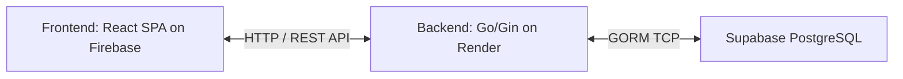

# ZigZag Barbershop Booking System

Sistem pemesanan (booking) terpadu untuk mitra barbershop, dikembangkan sebagai pemenuhan tugas proyek mata kuliah **IPPL (Implementasi Perangkat Lunak)**.

## 🚀 Fitur Utama
- **Autentikasi & Otorisasi:** Login menggunakan Email/Password dan Google OAuth. Pemisahan role antara `admin`, `barber`, dan `customer`.
- **Manajemen Reservasi (Booking):** Pelanggan dapat membuat jadwal potong rambut dengan barber tertentu.
- **Manajemen Absensi (Attendance):** Barber dapat memperbarui status ketersediaan/absensi mereka.
- **Katalog Layanan (Services):** Menampilkan daftar layanan potong rambut beserta harga dan durasi.

## 🛠️ Tech Stack Lengkap
- **Backend:** Go (v1.25.0) dengan framework [Gin](https://gin-gonic.com/)
- **Database:** PostgreSQL di-host di [Supabase](https://supabase.com/) (mengakses database via GORM)
- **Frontend:** React.js dengan React Router dan Axios
- **Hosting / Deployment:**
  - **Backend:** [Render](https://render.com/)
  - **Frontend:** [Firebase Hosting](https://firebase.google.com/docs/hosting)

## 🏗️ Arsitektur Sistem
Aplikasi menggunakan pola arsitektur Client-Server. Frontend (SPA React) berkomunikasi dengan Backend (Go RESTful API). Backend memproses request, menerapkan business logic (secara bertahap dipisahkan ke Service layer), dan berinteraksi dengan database Supabase PostgreSQL.



## ⚙️ Cara Setup & Run Secara Lokal

### Prerequisites
- [Go](https://golang.org/dl/) versi 1.25.0 atau lebih baru.
- [Node.js](https://nodejs.org/en/) & npm (untuk frontend).
- Akun Supabase untuk database, dan Akun Google Cloud untuk OAuth.

### Environment Variables (.env)
Buat file `.env` di root direktori **backend** dengan referensi dari `.env.example`:
- `PORT` : Port jalannya server (misal: 8080).
- `FRONTEND_URL` : URL frontend untuk keperluan CORS.
- `DATABASE_URL` : Connection string Supabase PostgreSQL (menggunakan port pooler 6543).
- `SEED_ADMIN_PASSWORD` dll : Password untuk inisialisasi database.
- `JWT_SECRET` : Secret key panjang untuk tanda tangan token JWT.
- `GOOGLE_CLIENT_ID` & `GOOGLE_CLIENT_SECRET` : Kredensial untuk Google OAuth.
- `GOOGLE_REDIRECT_URI` : URL callback Google OAuth.

Buat file `.env.local` di direktori **frontend**:
- `REACT_APP_API_URL` : Base URL Backend (misal: `http://localhost:8080/api`).

### Menjalankan Backend
1. Masuk ke folder root proyek.
2. Unduh dependensi:
   ```bash
   go mod tidy
   ```
3. Jalankan aplikasi (GORM akan otomatis melakukan auto-migrate tabel):
   ```bash
   go run ./cmd/main.go
   ```

### Menjalankan Frontend
1. Masuk ke folder `frontend`.
2. Install dependensi:
   ```bash
   npm install
   ```
3. Jalankan development server:
   ```bash
   npm start
   ```

## 📂 Struktur Folder Utama
- `/api/` : Konfigurasi rute (router) API backend.
- `/cmd/` : Titik masuk (*entry point*) aplikasi Go (`main.go`).
- `/config/` : Pembacaan konfigurasi environment backend.
- `/database/` : Koneksi ke PostgreSQL dan skrip `seed`.
- `/frontend/` : Source code lengkap dari aplikasi React.js.
- `/internal/` : Modular business logic backend (contoh: `auth`, `booking`, `attendance`).
- `/pkg/` : Pustaka utilitas bantuan (seperti *middleware*).

## 🌐 Link Deployment
- **Frontend Live URL:** [https://zigzag-barbershop-fd544.web.app](https://zigzag-barbershop-fd544.web.app)
- **Backend API Base:** `https://zigzag-barbershop-1.onrender.com`

---
*Dibuat untuk keperluan akademik.*